<picture>
  <source media="(prefers-color-scheme: dark)"  srcset="./http-hero-dark.svg" />
  <source media="(prefers-color-scheme: light)" srcset="./http-hero-light.svg" />
  
</picture>

---

### Tech Stack

**Frontend**

**Backend & Databases**

**DevOps & Cloud**

---

### GitHub Stats

&nbsp;&nbsp;

---

  <picture>
    <source media="(prefers-color-scheme: dark)"  srcset="./spider-web-dark.svg" />
    <source media="(prefers-color-scheme: light)" srcset="./spider-web-light.svg" />
    
  </picture>

